<h1 align="center">🧑‍💻 LeoNaldoDev — Full Stack Developer</h1>

  <em>Building modern, accessible and scalable web applications.</em>

---

## 🚀 About Me

I am a **Full Stack Developer** passionate about creating functional, accessible, and visually appealing web applications.  
My work ranges from **front-end design with React.js & Tailwind CSS** to **back-end integrations with Node.js & MongoDB**.

💡 I believe in **code quality, user experience, and continuous learning**.  
📍 Based in Lima, Peru.

---

## 🛠 Tech Stack

  
  
  
  
  
  
  
  
  
  

---

## 📌 Featured Projects

| Project | Description | Tech |
| ------- | ----------- | ---- |
| 🐶 **Pet Rescue Platform** | Full-stack app for dog rescue, with adoptions, store, and admin panel. | React, Node.js, MongoDB |
| 🛍 **Naldo’s Store** | E-commerce for men’s fashion with cart, product modal, and accessibility features. | React, TailwindCSS |
| 📊 **Admin Dashboard** | Responsive admin panel for managing data and content. | React, TailwindCSS |
| 🍹 **Fioreli’s Menu** | Digital menu with QR code for a juice & snack shop. | HTML, CSS, JavaScript |

---

## 📅 Experience Timeline

```mermaid
timeline
    title Development Journey
    2024 : Started as Full Stack Developer • Built Pet Rescue Platform
    2024 : Developed Naldo's Store • Focused on accessibility
    2025 : Enhanced admin dashboards • Integrated APIs with MongoDB Atlas
    2025 : Expanded portfolio with new responsive designs and UI improvements
```

---

## 📸 Portfolio Preview

> 

---

## 🔮 Roadmap

- Headless CMS Integration (Contentful / Notion API)

- Dark Mode with system preference detection

- Developer Blog for tutorials and insights

---

## 📬 Connect with Me

 
    
   
   

---
